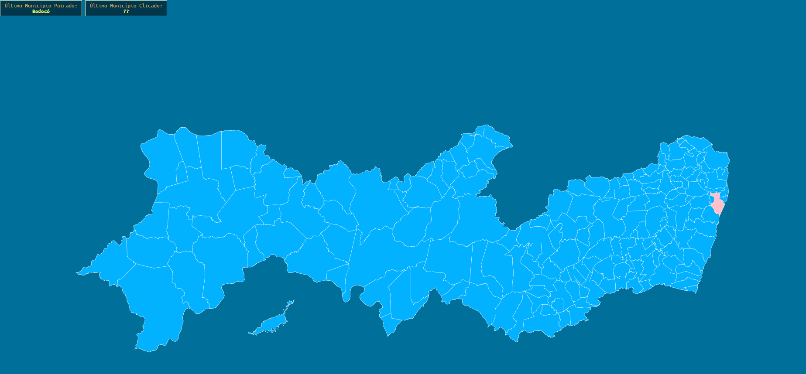

# Mapa de Pernambuco com JvectorMap

DocumentaçãoUtilizada:

-> [https://anshumania.github.io/delhi-map/howtocreate.html]([https://anshumania.github.io/delhi-map/howtocreate.html]())

Links Úteis:

svgConverter -> [https://ruibarreira.github.io/jvectormap-svg-converter/]([https://ruibarreira.github.io/jvectormap-svg-converter/]())

svgEdit -> [https://svgedit.netlify.app/editor/index.html](https://svgedit.netlify.app/editor/index.html)
